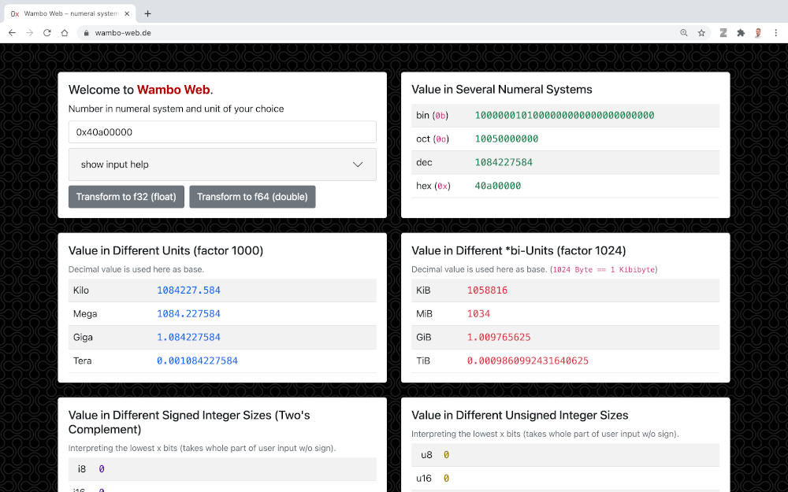

# Wambo Web

**Wambo can be found on the web: [wambo-web.de](wambo-web.de)**

Wambo Web is a simple web app to convert numbers (including fractions) between multiple numeral systems,
to interpret binary data as different sized integers, to transform a f32 value into integer bytes, 
or to check out the memory alignment of different endiannesses in a convenient, fast, and responsive way. 
It is mainly useful for low level developers and everyone who wants to understand more about bits, bytes, 
and sizes of different data units.

# Technology stack
This project is build using `Angular 11`, `Bootstrap 5`, and `bignumber.js`.

# How To Deploy / Run
## Apache web server
Build Wambo Web using `$ sh ./build.sh`. Copy the output of `./dist/wambo-web` including 
all files into a directory where your Apache Webserver serves static content. Note that an optimized
`.htaccess` files is already inside the built.

## Docker
Build Wambo Web using `$ sh ./build-docker.sh`, which creates the image `phip1611/wambo-web`. 
Inside the image there is a nginx web server which delivers the static content and takes 
care of 404 as well. It delivers statically compressed GZIP and BROTLI files out of the box.
You can run it using: \
`$ docker run --rm --name "wambo-web" -p 127.0.0.1:80:80 phip1611/wambo-web`

# Trivia
This project is free from external resources during runtime. It doesn't collect any data 
nor sends your IP to other domains.

There is an CLI version of this written in Rust: https://crates.io/crates/wambo 
